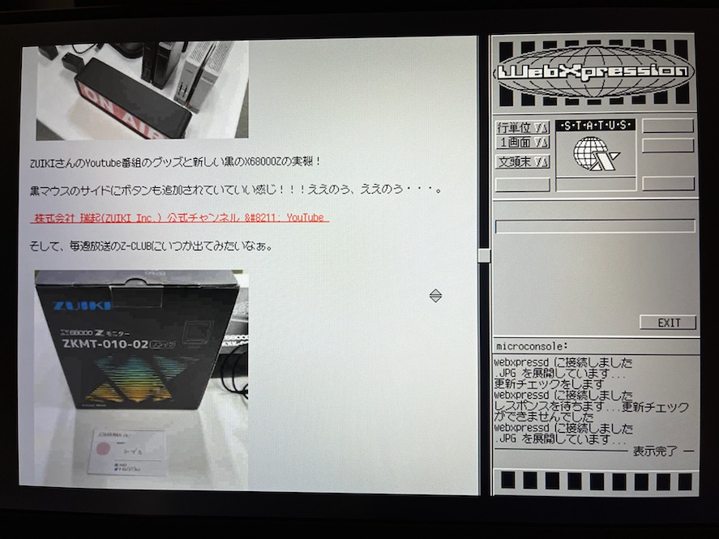
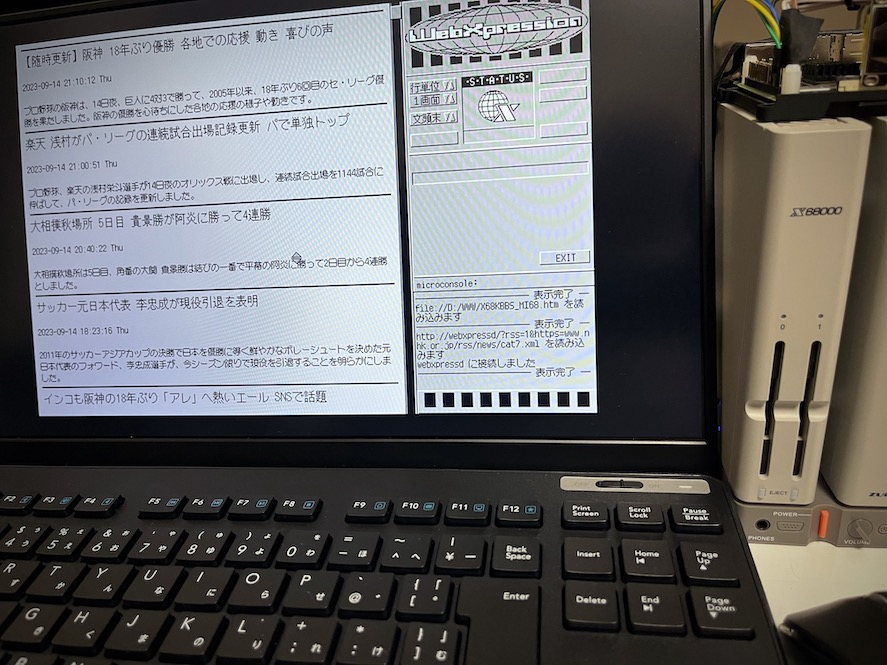

# webxpressd

Preprocessing Service for WebXpression

---

## はじめに

webxpressd は X680x0用 高性能WWWブラウザ WebXpression.x のためのpreprocessing serviceです。

* 文字コード変換
* httpsサイトへのアクセス
* 未対応タグの除去
* 画像の再圧縮

などを行います。Pythonで書かれているためプラットフォームを選びませんが、基本的にはRaspberry Pi OS上での動作を想定しています。

本ソフトウェアは WebXpressionを現代のサイトでも利用可能となるよう独自で開発しているものです。
WebXpression開発者の Mitsuky さんのご迷惑にならないよう、問い合わせについては tantan までお願いします。

---

## 前提条件

* [WebXpression.x version 0.46](http://retropc.net/x68000/software/internet/wwwbrowser/webxpression/)

* Raspberry Pi 4B (4GB)
* Raspberry Pi OS Lite (GUIなし、32bit) の最新版

でのみ確認しています。

Raspberry Pi はX680x0実機とIPネットワークで接続されており、かつインターネットにアクセスできる必要があります。
以下の覚書などを参考にしてください。

* [https://github.com/tantanGH/nereid-wifi-connection](https://github.com/tantanGH/nereid-wifi-connection)

---

## インストール

    sudo apt install -y git cmake libopenjp2-7 libxslt1-dev libcairo2-dev libjpeg-dev
    sudo apt install -y python3-pip python3-bs4 python3-pil python3-freetype python3-svglib python3-cairo python3-lxml
    pip install --brak-system-packages git+https://github.com/tantanGH/webxpressd.git

---

## 使い方

コマンドラインから起動します。

    webxpressd

デフォルトではポート6803番、画像クオリティ20で待ち受け開始します。

webxpressdは一般ユーザ権限で動かすため、予約ポート(1024未満)は使えません。
しかしWebXpressionは80番ポート以外接続できないので、このままでは利用できません。

このため、80番ポートへのアクセスを6803番ポートにリダイレクトする設定をiptablesに対して行います。

    sudo apt install iptables-persistent
    sudo iptables -t nat -A PREROUTING -p tcp --dport 80 -j REDIRECT --to-port 6803
    sudo netfilter-persistent save

一度設定するだけでokです。

X680x0側では、`\etc\hosts` に

    192.168.31.101    webxpressd

などとして、webxpressdが動いているホストに`webxpressd`の名前でアクセスできるようにしてください。WebXpressionはIPアドレスでのアクセスには対応していません。

また、WebXpressionのキャッシュディレクトリ(WEBCACHE)はRAMDISK上に取ることをお勧めします。NereidであればバンクメモリRAMDISKを活用するのが良いでしょう。

WebXpressionでサイトを閲覧する場合は、

    http://webxpressd?http=(httpサイトのURL)

または

    http://webxpressd?https=(httpsサイトのURL)

としてアクセスしてください。

---

## RSS News Feed

webxpressd は RSS News Reader 機能を持っています。通常のWebサイトに比べてダイジェストのみですので、はるかに軽量アクセスできます。

RSS News Feedを読む場合は、

    http://webxpressd?rss=1&http=(rss httpサイトのURL)

または

    http://webxpressd?rss=1&https=(rss httpsサイトのURL)

としてください。

---

## X68000Z で WebXpression.x を利用する際の注意

X68000Z で WebXpression.x version 0.46 を使用して画像ありのページを表示すると画面が乱れます。これは WebXpression.x 側で CRTCに設定している一部のレジスタ値が範囲外のものであるためです。これを修正して X68000Z でも正しく表示できるようにするための差分を以下に置きます。

* [WebXpression.bfd](https://github.com/tantanGH/webxpressd/raw/main/bfd/WebXpression.bfd)

ただし完全無保証です。

---

## 制限事項

* JavaScriptを使ったダイナミックなページには対応していません。
* その他たくさん

---

## 変更履歴

* 0.3.5 (2023/09/14) ... RSS表示に対応。
* 0.3.0 (2023/09/13) ... HEADの実装改善。WebXpression.xをX68000Zで正常動作させる差分を同梱。
* 0.2.7 (2023/09/10) ... SVG画像に対応。その他細かい修正。
* 0.2.0 (2023/09/09) ... 初版
